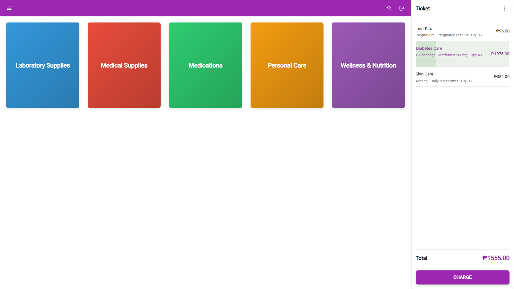
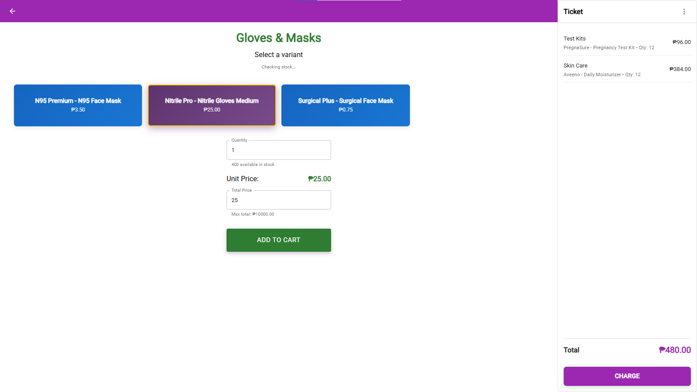
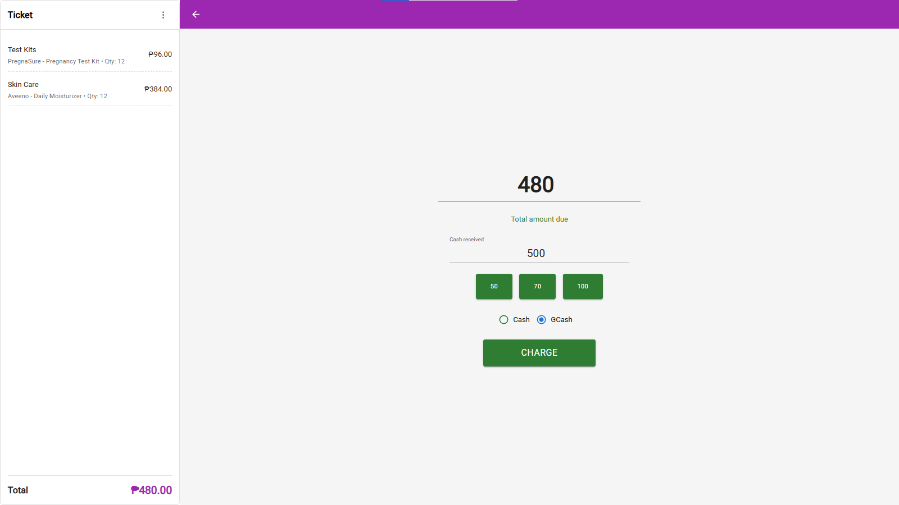
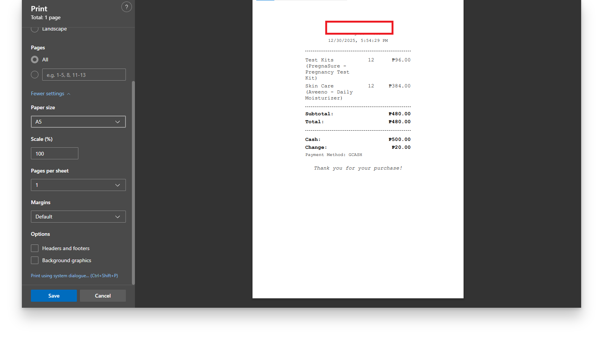
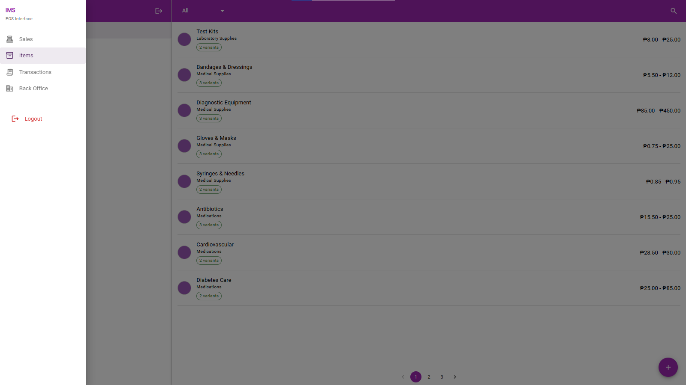
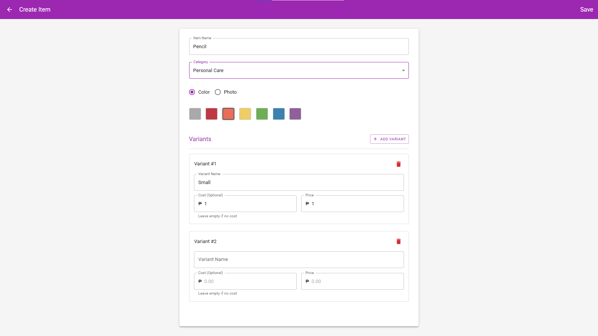
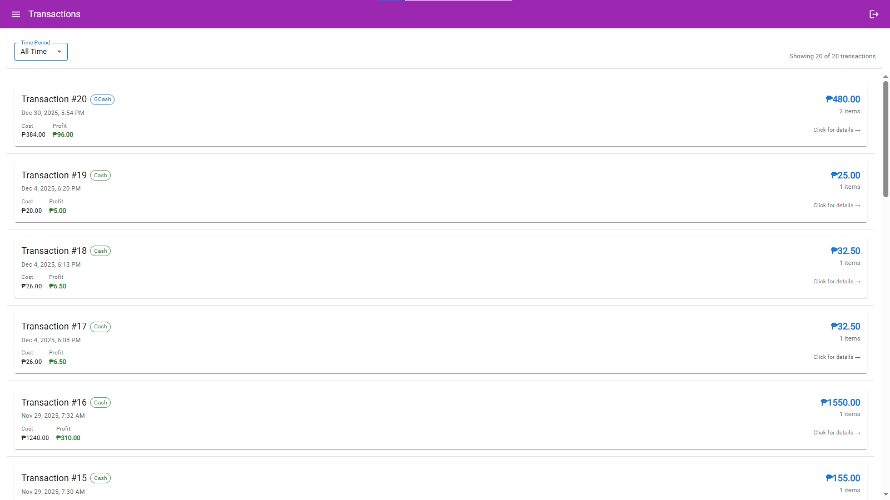
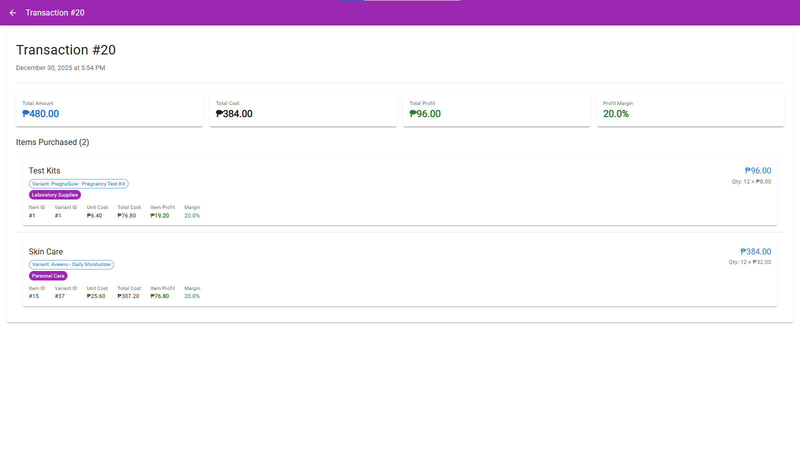
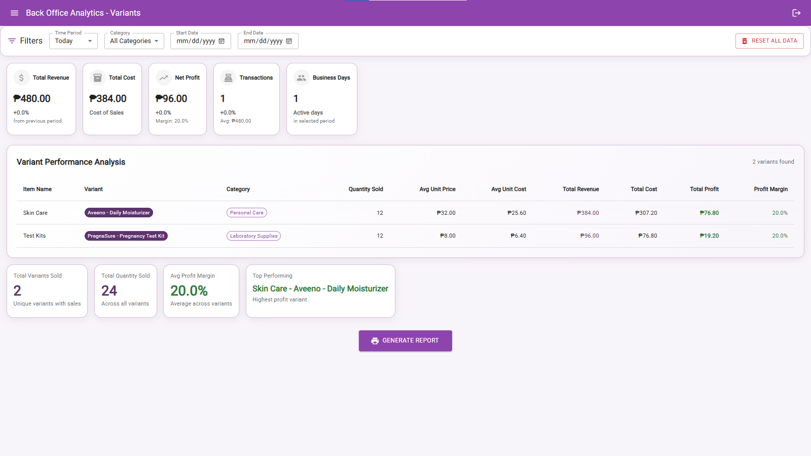

# Point of Sale System

##  Overview

Cross-platform desktop and mobile application for managing sales, transactions, and inventory with a modern interface. Features a smooth, user-friendly design with some similarity to Loyverse for comprehensive sales management.

---

##  Features

- Payment method support with receipt generation
- Report generation and sales analytics
- Product/service management with color/photo distinction
- Detailed transaction tracking
- Modern, responsive interface

---

##  Screenshots

  
  
  
   
  
  
  
   
  
  
  

---

##  Tech Stack

| Component | Technology               |
| --------- | ------------------------ |
| Frontend  | React, Material-UI (MUI) |
| Backend   | Node.js, Express         |
| Database  | SQLite                   |
| Mobile    | Capacitor                |

---

> **Note:** This repository intentionally excludes setup instructions and sensitive configuration details due to confidentiality requirements.
